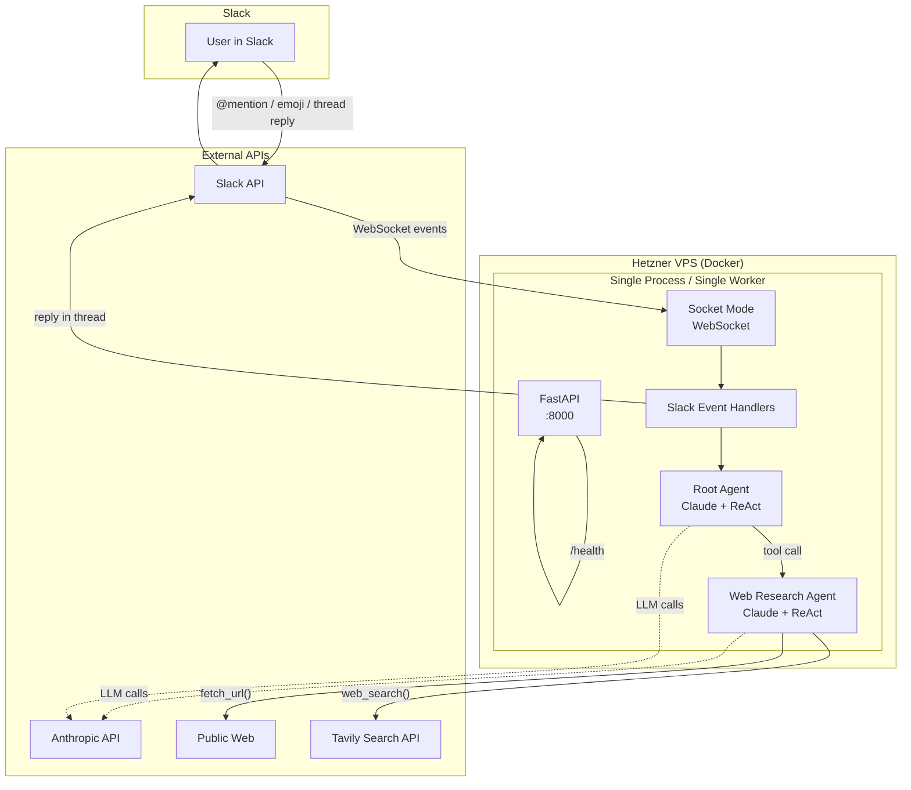
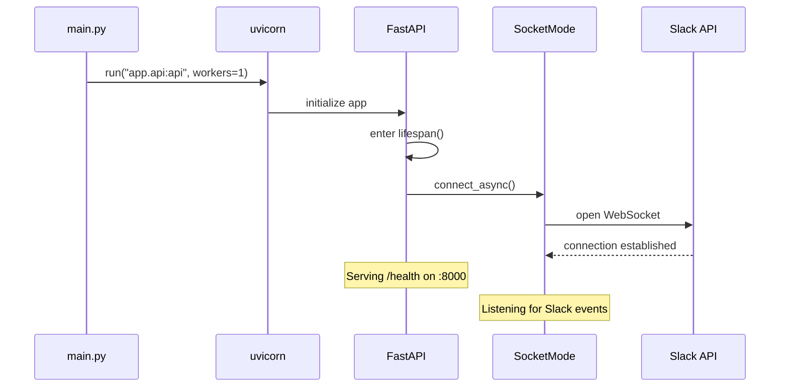
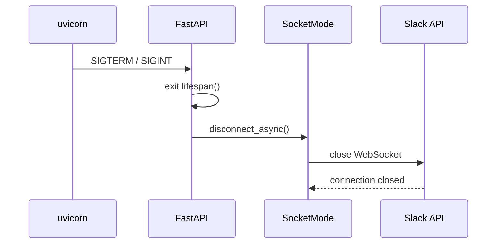
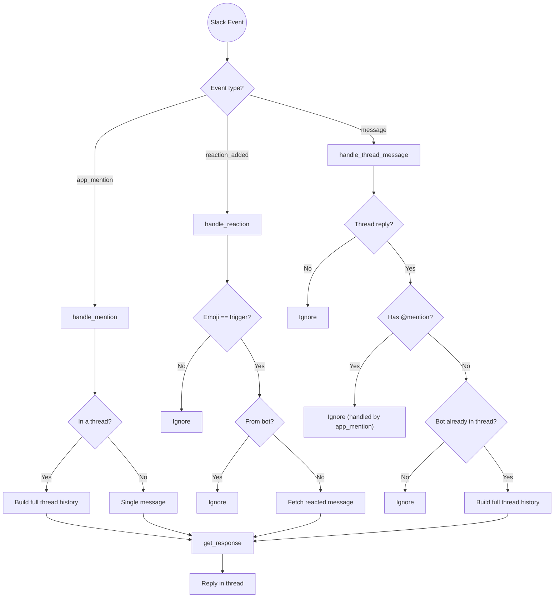
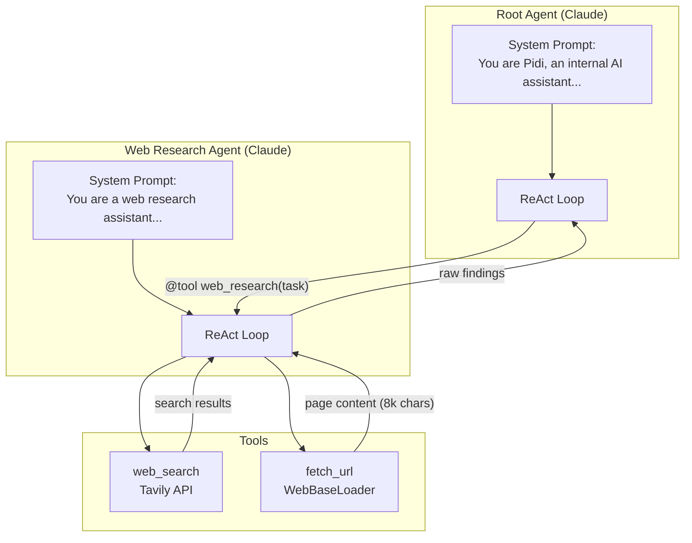
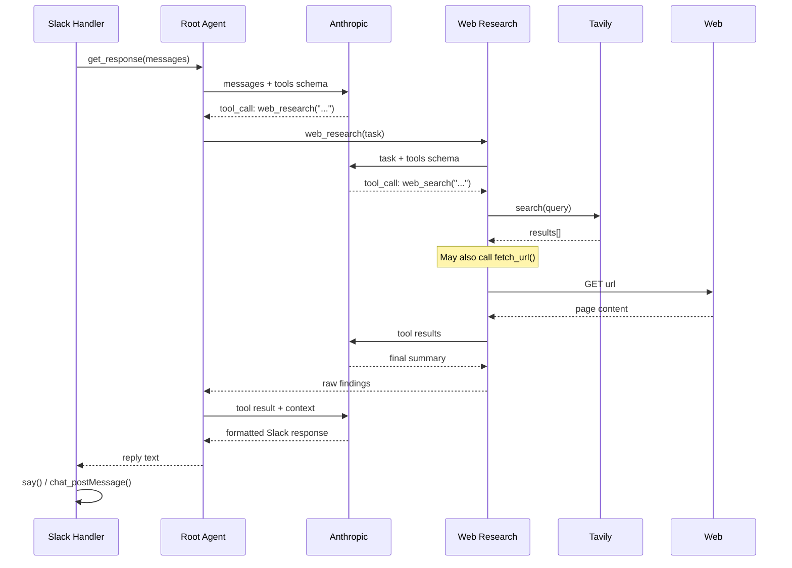
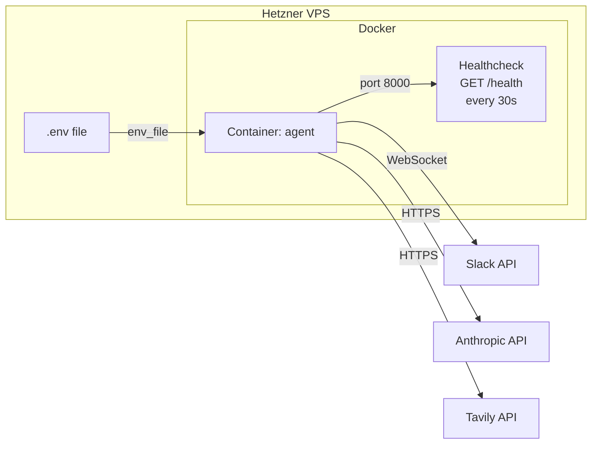

# Architecture

## High-Level Overview



## Startup Sequence



## Shutdown Sequence



## Event Handling

Three Slack events trigger the bot. Each resolves to a call to `get_response(messages)`.



## Multi-Agent Architecture

The agent layer uses a two-tier hierarchy built with LangChain's `create_agent`.



### Agent Call Sequence



## Deployment



| Component | Detail |
|-----------|--------|
| Base image | `python:3.12-slim` |
| Package manager | `uv` (copied from `ghcr.io/astral-sh/uv:latest`) |
| Workers | **1** (mandatory — multiple workers = duplicate Slack events) |
| Restart policy | `unless-stopped` |
| Health check | `GET /health` every 30s, 5s timeout, 3 retries |

## Project Structure

```
pd-general-purpose-agent/
├── main.py                          # Entrypoint — uvicorn (1 worker)
├── Dockerfile
├── docker-compose.yml
├── pyproject.toml                   # uv dependencies
├── .env.example
│
├── app/
│   ├── config.py                    # pydantic-settings (loads .env)
│   ├── api.py                       # FastAPI + lifespan (Socket Mode lifecycle)
│   ├── slack_app.py                 # 3 event handlers + thread history builder
│   │
│   └── agents/
│       ├── __init__.py              # Re-exports get_response()
│       ├── root/
│       │   ├── __init__.py          # Root agent + get_response()
│       │   └── prompt.py            # System prompt (reads version from pyproject.toml)
│       └── web_research/
│           ├── __init__.py          # Sub-agent exposed as @tool
│           ├── prompt.py            # System prompt
│           └── tools.py             # fetch_url, web_search
│
└── docs/                            # Planning & progress docs
```